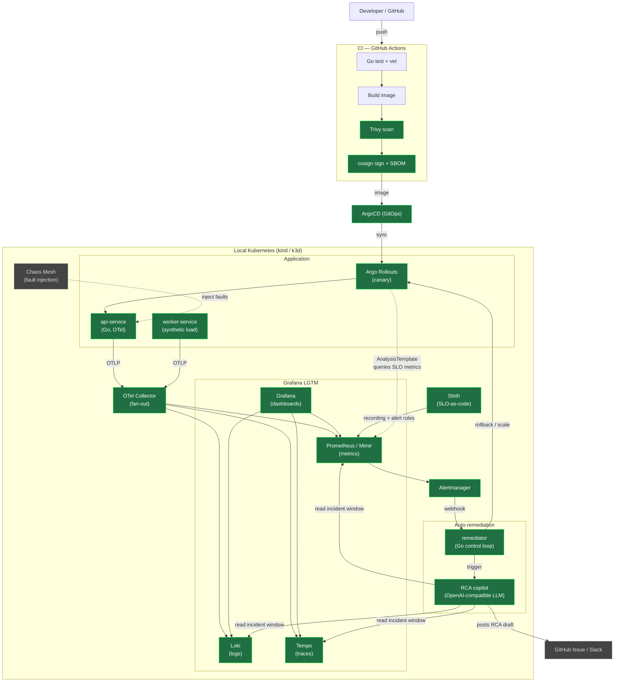
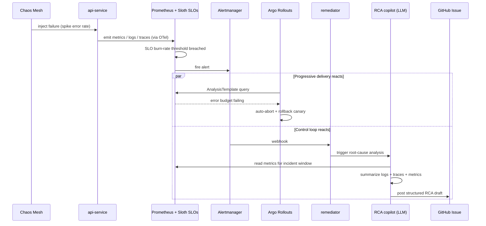

# OmniObserve

**A self-healing observability platform: it detects reliability regressions from telemetry and automatically remediates them — with an LLM assist for root-cause analysis.**

OmniObserve is a hands-on SRE/platform-engineering project built around the modern,
vendor-neutral observability stack (OpenTelemetry + Grafana LGTM). It runs entirely
**locally on Kubernetes** — no cloud bill — and is designed to demonstrate the full
reliability loop end to end:

> **chaos injection → SLO breach → alert → automatic rollback → AI-drafted RCA**

📖 **New here? Read the [phase-by-phase journey](docs/) — what each piece is and *why it matters*.**

---

## The big picture (target architecture)



> **Legend:** solid green = built / in place today · dashed grey = on the roadmap.

---

## The remediation loop (the demo)

This is the 90-second story the whole project builds toward:



---

## Roadmap & status

| Phase | Focus | Key tech | Status |
|------|-------|----------|--------|
| **0** | Stabilize the base | OpenTelemetry, Go tests, Sloth, Trivy/cosign | ✅ built |
| **1** | Progressive delivery | Argo Rollouts + Prometheus AnalysisTemplate | ✅ validated on a local cluster |
| **1.5** | Real telemetry | OpenTelemetry Demo + Tempo/Prometheus evidence | ✅ validated |
| **2** | Control loop + RCA copilot | Go `remediator`, flagd, OpenAI-compatible LLM | ✅ implemented; hardening |
| **3** | Story & polish | Chaos Mesh, demo recording | 📋 planned |

**Built today (Phase 0):**
- ✅ `api-service` — Go/Gin service with configurable KPI endpoints (availability, latency, error rate, benchmark), Swagger docs
- ✅ **OpenTelemetry tracing** via the OTel SDK + `otelgin`, exported **OTLP/gRPC to an OTel Collector** that fans out to Tempo/Prometheus/Loki ([`collector/`](collector/))
- ✅ Prometheus metrics on `/metrics` (numeric status codes), structured logging via zap
- ✅ **SLO-as-code** with Sloth — availability + latency SLOs → Prometheus burn-rate rules ([`slo/`](slo/))
- ✅ **Helm chart** for the app with a ServiceMonitor ([`deploy/api-service/`](deploy/api-service/))
- ✅ **CI**: vet/test (race)/build, golangci-lint, govulncheck, Trivy (deps + secrets), SLO-drift guard, helm lint
- ✅ **Supply chain**: image build with SBOM + provenance, cosign keyless signing, Trivy image scan ([`release.yml`](.github/workflows/release.yml))
- ✅ Grafana LGTM Helm values (secrets externalized), ArgoCD manifests, self-hosted runner

**Phase 1 (progressive delivery):**
- ✅ Argo **Rollout** (canary) with a shared pod template, toggled by `rollout.enabled` ([`deploy/api-service/`](deploy/api-service/))
- ✅ **AnalysisTemplate** querying Prometheus (5xx-ratio SLO gate) — auto-aborts and rolls back a bad canary
- ✅ Install docs ([`argo-rollouts/`](argo-rollouts/)) and a bad-deploy auto-rollback runbook ([`demo/`](demo/))
- ✅ Validated end-to-end on a local k3s cluster (bad → rollback, good → promote)

**Phase 1.5 (real telemetry):**
- ✅ OpenTelemetry Demo deployed as a realistic distributed workload ([`workloads/otel-demo/`](workloads/otel-demo/))
- ✅ Demo telemetry is routed through OmniObserve's collector into the local LGTM stack
- ✅ Incident corpus captures real implementation failures and fixes ([`incidents/`](incidents/))

**Phase 2 (auto-remediation + RCA copilot):**
- ✅ `remediator` receives Alertmanager webhooks, emits metrics, and is OTel-traced ([`remediator/`](remediator/))
- ✅ Bounded action disables named flagd fault flags with persisted cooldowns and narrow RBAC
- ✅ RCA copilot gathers Prometheus evidence, retrieves incident precedents, calls a vendor-agnostic LLM, and publishes to configured sinks
- ✅ `demo/chaos.sh` validates the unattended runtime-fault loop: fault → alert → heal → RCA
- ✅ Portfolio recording package, business-impact framing, and maturity scorecard are captured
  in the repo.

**Remaining polish (not blocking):** cut the actual demo video from the recording package and
publish it alongside the repo.

## Remaining tasks

### P0 — make the current loop quiet and defensible

- [x] Add explicit remediator action outcomes: `healed`, `already_safe`,
  `cooldown_skipped`, `unsupported`, `failed`, and `needs_human`.
- [x] Add a no-op storm guard so repeated `already_safe` remediations are suppressed,
  counted, and escalated instead of treated as normal success.
- [x] Add post-action verification: after a flag is disabled, query the relevant SLO signal
  and record whether the action actually improved it.
- [x] Add remediator SLOs and dashboard panels for webhook latency, action success rate,
  no-op rate, RCA queue drops, RCA draft latency, and post-action recovery.
- [x] Tune or document the OTel demo `accounting` memory behavior so the real-telemetry
  baseline is not noisy by default.

### P1 — harden the control plane

- [x] Add optional webhook authentication at the route boundary using Alertmanager
  authorization credentials, HMAC, or mTLS.
- [x] Add a NetworkPolicy profile for clusters with an enforcing CNI: ingress only from
  Alertmanager/Prometheus, egress only to the Kubernetes API and configured sinks.
- [x] Make secret ownership explicit for LLM, Grafana, and GitHub tokens; keep real
  `*-secret.yaml` files ignored.
- [x] Add a global stop switch for autonomous remediation.

### P1 — generalize beyond one hard-coded fault

- [x] Create a small declarative fault/action catalog for service, symptom, alert, action,
  safety limits, and evidence queries.
- [x] Add per-service PrometheusRules that match the catalog entries.
- [x] Make the remediator look up actions from the catalog instead of alert-specific code.
- [x] Wire the demo scripts to the same catalog so injection, detection, remediation, and
  RCA use one source of truth.
- [x] Add at least two more services beyond `product-catalog`, such as `ad` and `cart`, to
  prove this is a platform pattern rather than a scripted one-off.

### P2 — improve RCA quality and autonomy

- [x] Add confidence scoring to RCA drafts based on evidence coverage, corpus match quality,
  and whether the post-action signal recovered.
- [x] Add explicit RCA sections for evidence, likely cause, action taken, result, confidence,
  and proposed follow-up.
- [x] Ensure corpus drafts land in a reviewable destination before becoming permanent
  incident memory.
- [x] Add progressive autonomy modes: `observe`, `suggest`, `approval`, `auto`, and
  `auto-with-verify`.

### P2 — finish the portfolio shape

- [x] Restructure `application/` into `services/api-service`.
- [x] Add `services/worker-service` as a lightweight synthetic workload generator.
- [x] Move reusable telemetry setup into `services/shared/telemetry`.
- [x] Retire Grafana Agent or migrate the remaining config to Alloy.
- [x] Add the 90-second demo recording package: bad deploy rollback, runtime fault heal, RCA
  draft, and UI verification checklist.
- [x] Add a business-impact section covering MTTR reduction, avoided outage minutes, toil
  saved, and observability cost discipline.
- [x] Add a service-maturity scorecard that ties this project back to Staff SRE/platform
  leverage.

## Business Impact

OmniObserve is intentionally local-first, but the reliability economics map to a production
platform:

| Lever | What the project proves | Impact story |
|---|---|---|
| MTTR reduction | SLO alert -> remediator action -> verification -> RCA draft | Humans start from evidence and outcome, not a blank page. |
| Avoided outage minutes | Argo Rollouts aborts bad canaries; flagd kill switches stop runtime faults | Reversible automated action cuts customer-impact duration. |
| Toil saved | Worker traffic, catalog-driven chaos, dashboard panels, RCA drafting | Repeated demo/incident work becomes repeatable platform workflow. |
| Cost discipline | Local k3s/Rancher Desktop, OSS LGTM, optional Grafana Cloud export | Architecture is portable without requiring a cloud bill to be real. |
| Adoption leverage | Fault catalog, shared telemetry package, Helm charts, maturity scorecard | Teams get a paved road instead of bespoke observability glue. |

The concise interview framing: this turns observability from a passive dashboard into an
auditable control loop that detects, acts, verifies, and explains.

## Service Maturity Scorecard

| Dimension | Current level | Evidence in this repo | Next production step |
|---|---:|---|---|
| Observability | 4/5 | OTel SDK, shared telemetry, Collector fan-out, Prometheus, Tempo, optional Alloy logs | Generate service dashboards from catalog metadata. |
| Reliability/SLOs | 4/5 | Sloth SLOs, PrometheusRules, Argo Rollouts analysis, runtime SLO alerts | Add multi-window burn-rate policies per service tier. |
| Delivery | 4/5 | CI tests/lint/vuln scan, signed image release workflow, Rollout canaries | Enforce signed images with admission policy. |
| Operability | 4/5 | Bootstrap scripts, OpenTofu local stack, demo runbooks, dashboard panels | Add one-command reset and scripted demo recording. |
| Auto-remediation | 4/5 | Catalog allowlist, stop switch, autonomy modes, verification, RCA confidence | Promote catalog to a `RemediationPolicy` CRD. |
| Governance | 3/5 | Staff architecture notes, business-impact framing, reviewable RCA corpus drafts | Add service ownership/catalog metadata and approval workflow. |

The scorecard is deliberately simple: it gives a staff-level story for how this grows from
one demo loop into a platform capability adopted across services.

## Run it locally

On a clean local cluster (Rancher Desktop / kind / k3d), from the repo root:

```bash
./bootstrap.sh          # Prometheus Operator + Argo Rollouts + api-service (canary)
```

Then follow [demo/README.md](demo/) to watch a bad canary auto-roll-back on an SLO breach.
For rich, real telemetry, add the [OpenTelemetry Demo](workloads/otel-demo/) as a workload.

---

## Architecture decisions worth calling out

- **OTel Collector as the fan-out layer**, not direct SDK→backend export. Services emit one
  vendor-neutral OTLP stream; backends can change without touching service code.
- **Metrics stay on Prometheus `/metrics`** (scrape model) while traces go through OTel —
  the OTel Prometheus bridge keeps existing scrape infrastructure working unchanged.
- **Local-first, $0 cost.** Everything runs on kind/k3d + Docker Compose. The reliability
  patterns (SLOs, progressive delivery, auto-remediation) don't need a cloud bill to be real.
- **flagd kill switches for remediation.** They are reversible, scoped, fast to observe, and
  safe enough for an autonomous local demo before introducing more dangerous actions.
- **ConfigMap annotations for cooldown state.** Cooldowns persist across remediator restarts
  and stay attached to the exact Kubernetes object being mutated, without introducing a
  database.
- **Fault/action catalog before a CRD.** The next abstraction should be a small declarative
  catalog that maps service symptoms to allowlisted actions; only graduate to a
  `RemediationPolicy` CRD once several services share the same pattern.

---

## Staff architecture direction

The current implementation proves the loop, but the staff-level problem has shifted from
*"can it act?"* to *"can it decide when not to act, prove whether action helped, and scale
the pattern safely across services?"*

**Current control-loop reality:**
- Built: Alertmanager webhook, bounded flagd remediation, persisted cooldowns, narrow RBAC,
  bounded RCA queue, Prometheus evidence gathering, corpus retrieval, and LLM-backed RCA
  publishing.
- Validated: Phase 1 bad deploy rollback and Phase 2 runtime flag heal with RCA draft.
- Live lesson from 2026-06-08: the remediator can receive repeated firing alerts where the
  target flag is already off. That no-op churn should be measurable, suppressible, and
  escalated when automation has no useful state transition left.
- Live lesson from 2026-06-08: the OTel demo `accounting` pod OOM-restarted at the default
  local chart memory limit; demo resource tuning should be documented before treating that
  workload as a clean baseline.

**Control-loop health should be first-class:**
- Track outcomes separately: `healed`, `already_safe`, `cooldown_skipped`, `unsupported`,
  `failed`, and `needs_human`.
- Define remediator SLOs: webhook p95 latency, action success rate, no-op rate, queue drop
  rate, RCA draft latency, and post-action signal improvement.
- Treat repeated `already_safe` outcomes as a signal that the policy needs suppression,
  better verification, or human escalation.

**RCA quality bar:**
- Cite alert name, service, time window, and evidence source.
- Include concrete Prometheus evidence, not only prose.
- Retrieve similar prior incidents from the corpus.
- Distinguish demo-injected faults from unknown production regressions.
- Label the drafting model and record whether remediation worked.
- Publish corpus drafts to a reviewable destination instead of silently rewriting main.
- Score RCA confidence deterministically from Prometheus evidence coverage, prior-incident
  matches, and post-action recovery signal; the LLM reports this score instead of inventing
  its own confidence.

**Progressive autonomy:**

| Level | Behavior | Use case |
|---|---|---|
| `observe` | alert, gather evidence, no suggestion | new or risky service |
| `suggest` | draft RCA and proposed action, no mutation | medium confidence |
| `approval` | request human approval before action | higher blast radius |
| `auto` | act immediately within bounds | reversible low-risk action |
| `auto-with-verify` | act, verify recovery, record result in RCA confidence | mature policy |

The remediator now enforces this as a global ceiling via `autonomy.mode` /
`REMEDIATOR_AUTONOMY_MODE`, while the fault catalog can choose an equal-or-safer mode per
policy. `auto-with-verify` waits for the Prometheus after-sample before enqueuing the RCA,
so the draft's result and confidence reflect whether the signal actually recovered.

**Next catalog shape:**

```yaml
service: product-catalog
symptom: high-grpc-error-rate
detect:
  alert: ProductCatalogHighErrorRate
act:
  type: disable-flag
  flag: productCatalogFailure
safety:
  cooldown: 10m
  autonomy: auto-with-verify
  maxActionsPerHour: 1
evidence:
  prometheusQueries:
    - error_ratio
    - request_rate
```

That catalog should drive PrometheusRule generation, Alertmanager annotations, remediator
action lookup, demo fault injection, and RCA evidence retrieval.

**Production hardening matrix:**

| Decision | Current local choice | Production-grade direction | Reason |
|---|---|---|---|
| State store | ConfigMap annotation | CRD status or Lease when multi-service | Persist without a database first |
| Action | Disable flagd flag | Policy-driven allowlist | Reversibility before power |
| Auth | In-cluster routing | HMAC, mTLS, or OIDC | No unauthenticated mutation |
| RCA | Prometheus + corpus + LLM | Metrics, traces, logs, deploy events, confidence | Grounded explanations |
| Scope | One local cluster | Tenant/service-scoped policies | Limit blast radius |
| Adoption | One demo loop | Service catalog + maturity scorecard | Platform leverage |

**Known architectural debt:**
- PrometheusRule generation from the catalog is not automated yet.
- `auto-with-verify` records non-recovery and lowers RCA confidence, but does not yet
  automatically revert or escalate failed verification.
- The NetworkPolicy profile is available but disabled by default until an enforcing CNI is
  part of the local setup.
- Lower-traffic demo services such as `ad` and `cart` may need targeted load before their
  SLO alerts fire quickly.

---

## Tech stack

`Go` · `OpenTelemetry` · `Prometheus` · `Loki` · `Tempo` · `Grafana` · `Argo Rollouts` ·
`ArgoCD` · `Sloth` · `Chaos Mesh` · `Kubernetes (kind/k3d)` · `GitHub Actions` ·
`Trivy` · `cosign` · `OpenAI-compatible LLM`

## Repository layout

```
OmniObserve/
├── services/           # Go services and shared service libraries
│   ├── api-service/    # OTel-instrumented KPI API
│   ├── worker-service/ # Synthetic workload generator
│   └── shared/         # Shared service libraries, including telemetry
├── collector/          # OTel Collector config + local docker-compose
├── slo/                # SLO-as-code (Sloth spec + generated Prometheus rules)
├── deploy/api-service/ # Helm chart (Deployment or Rollout, Service, ServiceMonitor, AnalysisTemplate)
├── deploy/worker-service/ # Helm chart for steady synthetic load
├── bootstrap.sh        # one-command local stack (Prometheus + Argo Rollouts + api-service)
├── argo-rollouts/      # Argo Rollouts install + progressive-delivery docs
├── demo/               # SLO-gated auto-rollback walkthrough + load script
├── workloads/otel-demo # real OTel-native app to observe (rich telemetry + fault injection)
├── LGTM/               # Grafana LGTM values + optional Alloy pod-log shipping
├── argocd/             # ArgoCD Application manifests
├── .github/workflows/  # CI (ci.yml) + signed image release (release.yml)
├── runner/             # Self-hosted GHA runner image
└── infrastructure/     # Terraform (AWS skeleton — parked; local-first for now)
```
