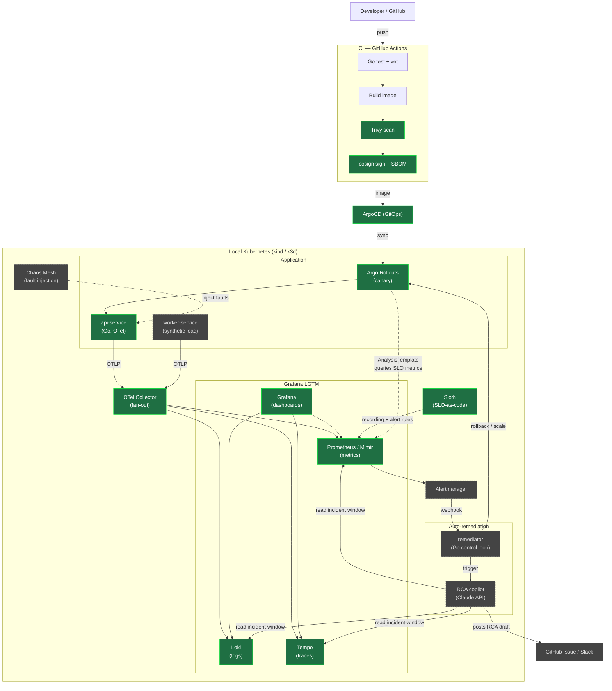
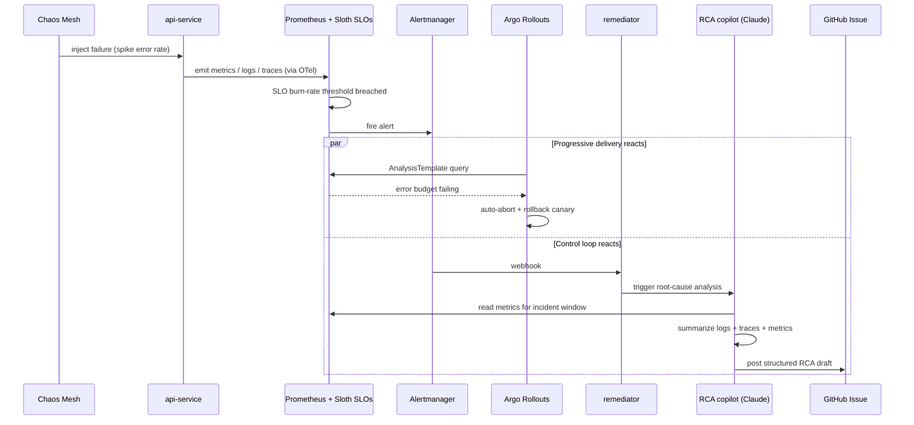

# OmniObserve

**A self-healing observability platform: it detects reliability regressions from telemetry and automatically remediates them — with an LLM assist for root-cause analysis.**

OmniObserve is a hands-on SRE/platform-engineering project built around the modern,
vendor-neutral observability stack (OpenTelemetry + Grafana LGTM). It runs entirely
**locally on Kubernetes** — no cloud bill — and is designed to demonstrate the full
reliability loop end to end:

> **chaos injection → SLO breach → alert → automatic rollback → AI-drafted RCA**

---

## The big picture (target architecture)



> **Legend:** solid green = built / in place today · dashed grey = on the roadmap.

---

## The remediation loop (the demo)

This is the 90-second story the whole project builds toward:



---

## Roadmap & status

| Phase | Focus | Key tech | Status |
|------|-------|----------|--------|
| **0** | Stabilize the base | OpenTelemetry, Go tests, Sloth, Trivy/cosign, Alloy | 🚧 in progress |
| **1** | Progressive delivery | Argo Rollouts + Prometheus AnalysisTemplate | 🚧 implemented (pending cluster validation) |
| **2** | Control loop + RCA copilot | Go `remediator`, Claude API | 📋 planned |
| **3** | Story & polish | Chaos Mesh, demo recording | 📋 planned |

**Built today (Phase 0):**
- ✅ `api-service` — Go/Gin service with configurable KPI endpoints (availability, latency, error rate, benchmark), Swagger docs
- ✅ **OpenTelemetry tracing** via the OTel SDK + `otelgin`, exported **OTLP/gRPC to an OTel Collector** that fans out to Tempo/Prometheus/Loki ([`collector/`](collector/))
- ✅ Prometheus metrics on `/metrics` (numeric status codes), structured logging via zap
- ✅ **SLO-as-code** with Sloth — availability + latency SLOs → Prometheus burn-rate rules ([`slo/`](slo/))
- ✅ **Helm chart** for the app with a ServiceMonitor ([`deploy/api-service/`](deploy/api-service/))
- ✅ **CI**: vet/test (race)/build, golangci-lint, govulncheck, Trivy (deps + secrets), SLO-drift guard, helm lint
- ✅ **Supply chain**: image build with SBOM + provenance, cosign keyless signing, Trivy image scan ([`release.yml`](.github/workflows/release.yml))
- ✅ Grafana LGTM Helm values (secrets externalized), ArgoCD manifests, self-hosted runner

**Phase 1 (progressive delivery):**
- ✅ Argo **Rollout** (canary) with a shared pod template, toggled by `rollout.enabled` ([`deploy/api-service/`](deploy/api-service/))
- ✅ **AnalysisTemplate** querying Prometheus (5xx-ratio SLO gate) — auto-aborts and rolls back a bad canary
- ✅ Install docs ([`argo-rollouts/`](argo-rollouts/)) and a bad-deploy auto-rollback runbook ([`demo/`](demo/))
- ⏳ End-to-end run pending a local cluster

**Remaining Phase 0 polish (not blocking):** restructure into `services/` + a `worker-service` load generator; retire the deprecated Grafana Agent in favour of Alloy.

---

## Architecture decisions worth calling out

- **OTel Collector as the fan-out layer**, not direct SDK→backend export. Services emit one
  vendor-neutral OTLP stream; backends can change without touching service code.
- **Metrics stay on Prometheus `/metrics`** (scrape model) while traces go through OTel —
  the OTel Prometheus bridge keeps existing scrape infrastructure working unchanged.
- **Local-first, $0 cost.** Everything runs on kind/k3d + Docker Compose. The reliability
  patterns (SLOs, progressive delivery, auto-remediation) don't need a cloud bill to be real.

---

## Tech stack

`Go` · `OpenTelemetry` · `Prometheus` · `Loki` · `Tempo` · `Grafana` · `Argo Rollouts` ·
`ArgoCD` · `Sloth` · `Chaos Mesh` · `Kubernetes (kind/k3d)` · `GitHub Actions` ·
`Trivy` · `cosign` · `Claude API`

## Repository layout

```
OmniObserve/
├── application/        # Go api-service (OTel-instrumented)  → moves to services/ in Phase 0.2
├── collector/          # OTel Collector config + local docker-compose
├── slo/                # SLO-as-code (Sloth spec + generated Prometheus rules)
├── deploy/api-service/ # Helm chart (Deployment or Rollout, Service, ServiceMonitor, AnalysisTemplate)
├── argo-rollouts/      # Argo Rollouts install + progressive-delivery docs
├── demo/               # SLO-gated auto-rollback walkthrough + load script
├── LGTM/               # Grafana LGTM Helm values (secrets externalized) + local MinIO
├── argocd/             # ArgoCD Application manifests
├── .github/workflows/  # CI (ci.yml) + signed image release (release.yml)
├── runner/             # Self-hosted GHA runner image
└── infrastructure/     # Terraform (AWS skeleton — parked; local-first for now)
```
